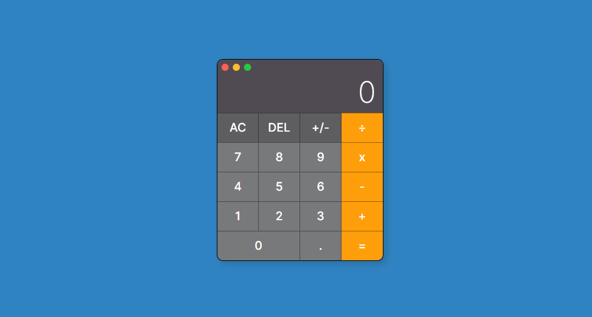

<h1 align="center">🧮 Calculadora</h1>

  

## 🚀 Tecnologias

Este projeto foi desenvolvido com as seguintes tecnologias:

- ✅ HTML  
- ✅ CSS  
- ✅ JavaScript  
- ✅ Git e GitHub  

## 💻 Sobre o Projeto

A **Calculadora** é um projeto simples e funcional, desenvolvido com o objetivo de praticar conceitos fundamentais do desenvolvimento web.

> Realiza operações básicas (adição, subtração, multiplicação e divisão) com uma interface leve e responsiva.

📌 Projeto disponível online:  
👉 [Clique aqui para acessar a calculadora funcionando](https://ricantony6.github.io/Calculadora/)

---

### 👨‍💻 Desenvolvido por:

**Ricardo Antonio Rodrigues**  
💡 Projeto pessoal para aprendizado e prática de programação web.

---
